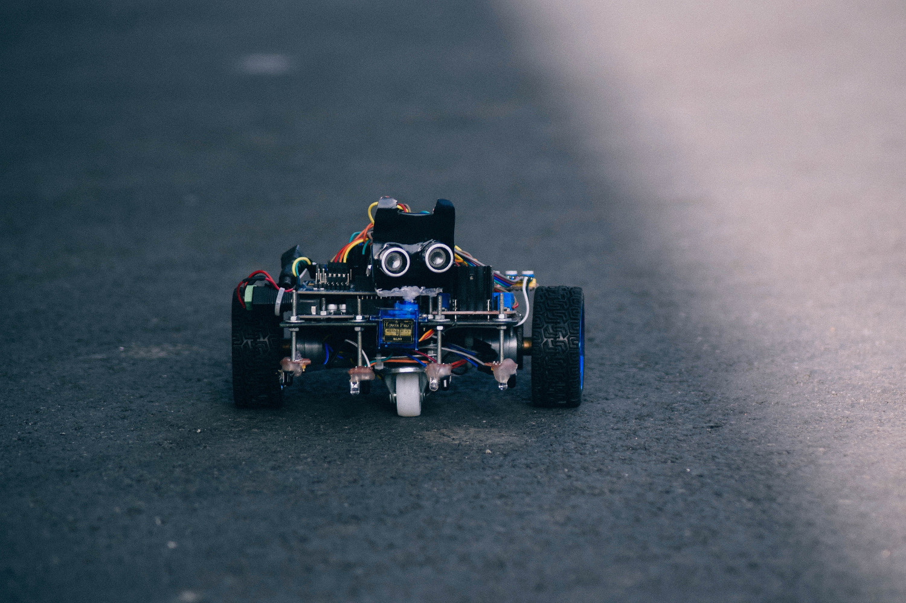

In a nutshell, **"A class should only have a single reason to change."** There is separation of distinct concerns in classes handling different, independent tasks or problems. Every module or class should have a responsibility over a single part of the functionality provided by the software, and that responsiblity should be entirely encapsulated by the class.

<sub>Photo from Unsplash</sub>

We can describe this in a more C++ approach. Let's consider creating a game hero class with attributes, abilities and movement.

#### Bad example

```cpp
class Hero {
private:
  int stren_, agil_, intel_;
  int health_, level_;

  double pos_x_, pos_y_;
public:
  // Hero attributes
  int GetStrength() const { return stren_; }
  void SetStrength(int stren){ stren_ = stren; }
  int GetAgility() const { return agil_; }
  void SetAgility(int agil){ agil_ = agil; }
  int GetIntelligence() const { return intel_; }
  void SetIntelligence(int intel){ intel_ = intel; }

  int GetHealth() const { return health_; }
  void SetHealth(int health){ health_ = health; }
  int GetLevel() const { return level_; }
  void SetLevel(int level){ level_ = level; }

  // Hero ability
  void LevelUp();
  void Attack();
  void Heal();

  // Hero movement
  void Blink();
  void Teleport();
};
```

At first glance, this class might look correctly written. However, this class violates the single responsibility principle, in that it has other reasons to change. _LevelUp()_, _Attack()_ and _Heal()_ are for modifying the attributes of the hero (e.g. _level_, _health_, _stren_, _agil_ and _intel_), while the _Blink()_ and _Teleport()_ are for the hero's movement. In a way, there is a mixup of how the hero's attributes will change and how the logic of the hero's movement is going to shift.

To fix this, we can write classes to separate the hero's abilities and movement.

#### Good example

```cpp
class Hero {
private:
  int stren_, agil_, intel_;
  int health_, level_;

  double pos_x_, pos_y_;
public:
  int GetStrength() const { return stren_; }
  void SetStrength(int stren){ stren_ = stren; }
  int GetAgility() const { return agil_; }
  void SetAgility(int agil){ agil_ = agil; }
  int GetIntelligence() const { return intel_; }
  void SetIntelligence(int intel){ intel_ = intel; }

  int GetHealth() const { return health_; }
  void SetHealth(int health){ health_ = health; }
  int GetLevel() const { return level_; }
  void SetLevel(int level){ level_ = level; }

  double GetPosX() const { return pos_x_; }
  void SetPosX(double pos_x){ pos_x_ = pos_x; }
  double GetPosY() const { return pos_y_; }
  void SetPosY(double pos_y){ pos_y_ = pos_y; }
};

class HeroAbility {
public:  
  void LevelUp(Hero &hero);
  void Attack(Hero &hero);
  void Heal(Hero &hero);
};

class HeroMovement {
public:  
  void Blink(Hero &hero);
  void Teleport(Hero &hero);
};
```

With this design, we are able to separate the hero's attributes, abilities and movement. If in any case that there will be changes in the logic of the movement or abilities, we will only be focusing our modifications to _HeroMovement_ or _HeroAbility_ instead of _Hero_ class.