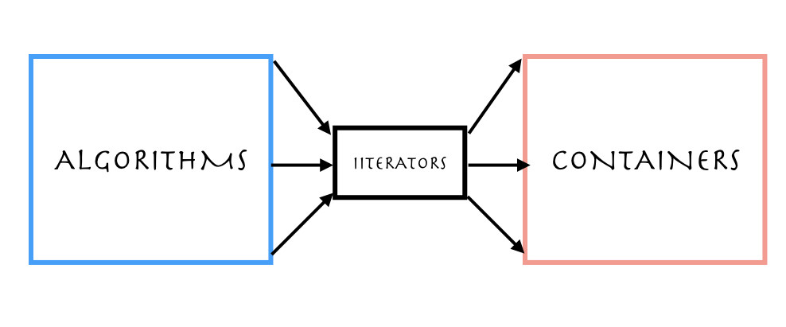

#### What is STL?

STL is standard template library for an advanced, high-level programming language C++. STL is at the heart of C++ Standard Library. It separates the data store and data manipulation.

<sub>Photo from Unsplash</sub>

STL has _Algorithms_ and _Containers_. _Containers_ contain data while _Algorithms_ operate on the data contained in the _Containers_. STL also provide another set of modules called _Iterators_. Each container is required to provide a common interface defined by _Iterators_. _Iterator_ can iterate each item inside the _Container_, so the _Algorithm_ instead of working in the _Container_ directly, it only works on the iterator. The algorithm doesn't know directly the container that it is working on. It only knows about the iterator. That improves the level of code reuse in C++.



Let's see a _sorting_ example using STL.

```cpp
std::vector<int> vec;   // initialize a vector
vec.push_back(3);       // add elements to vector
vec.push_back(2);
vec.push_back(9);       // vec: {3, 2, 9}

vector<int>::iterator i1 = vec.begin(); // start of iterator
vector<int>::iterator i2 = vec.end();   // end of iterator

sort(i1, i2);           // vec: {2, 3, 9}
```

#### Good reasons to use C++ Standard Template Library
1. Code reusability. No need to re-invent the wheel.
2. It is efficient. Is is fast and uses less resources. Modern C++ compilers are tuned to optimize for C++ STL.
3. It is peer-reviewed by a peer-review international committee.
4. It is a readable code.
5. It is standardized, guaranteed to be available.
6. It is a good model for writing a library.
7. Good knowledge of data structures and algorithms benefits in acing a job interview.