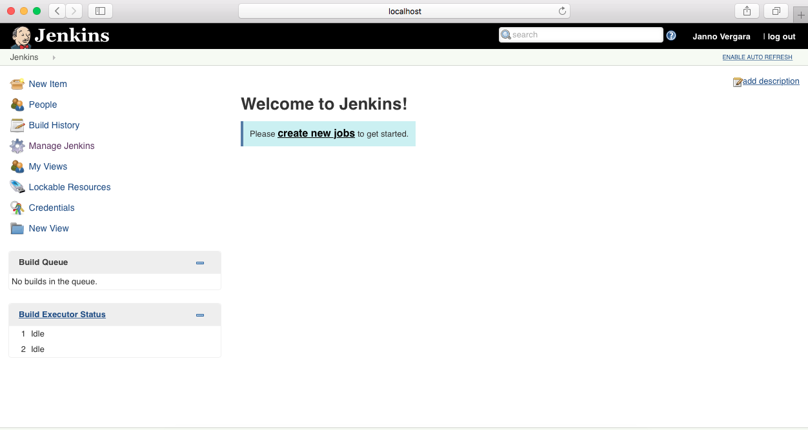

Great projects need efficient tools. Jenkins specializes in build automation for continuous integration in software development.

Photo from Unsplash

To download Jenkins, visit the [site](https://www.jenkins.io/). I downloaded Jenkins for Mac. Installation went smooth and it opens Safari browser as its main window. It will need an admin user to initiate integration, so a quick registration setup went through.

This is how Jenkins load in Safari.

Let's _create new jobs_.

In _Enter an item name_, input the sample project name e.g. _Hello World_ then select _Freestyle project_ > _OK_. This will create a new Jenkins project.

Next window will be a series of configuration settings. 

We will initially follow this basic configuration:
#### General
This is a C++ hello world project.

#### Source Code Management
None

#### Build Triggers
Build Periodically. Insert in _Schedule_ window editor: _H/15 * * *_

#### Build Environment
None

#### Build
Configuration for this section depends on your working environment. For my purpose, I'll select _Execute shell_. In the _Command_ window editor, write a simple shell script to build _HelloWorld.cpp_

#### Post-build Actions
None