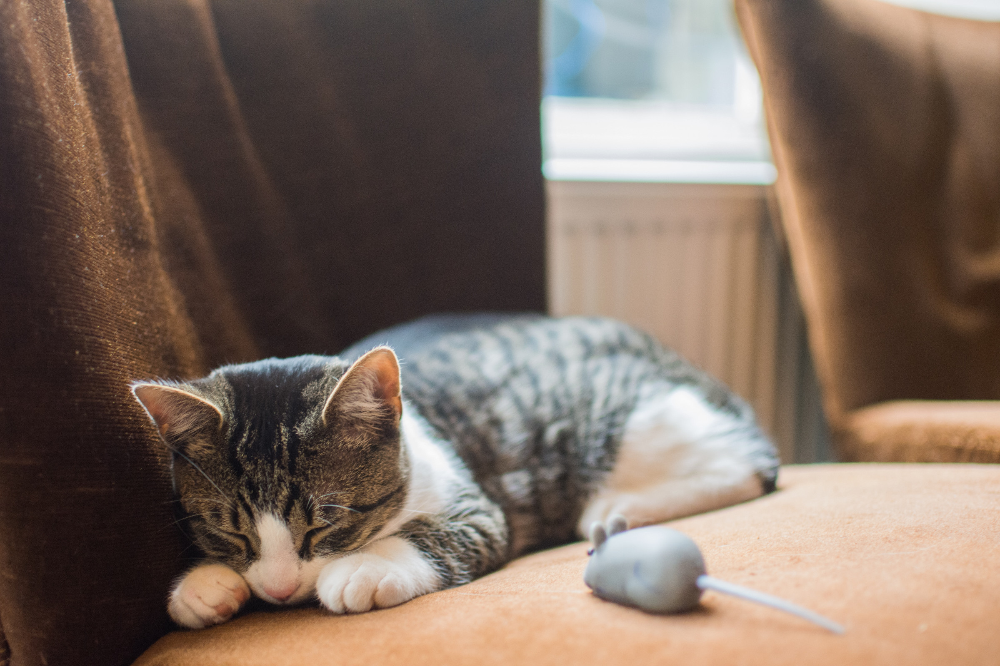

In this tutorial, we will show how object oriented paradigm can be applied in C++ development. Covered in this is a sample _Fighter_ and _Battle_ program showing the relationship of the _Fighter_ class as being used in the _Battle_ class.

<sub>Photo from Unsplash</sub>

C++ code.

```cpp
// Fighter.hpp

#ifndef FIGHTER_H
#define FIGHTER_H

#include <iostream>

class Fighter
{
private:
    int atk_max, blk_max;
public:
    std::string name;
    int health;
    int Attack();
    int Block();

    Fighter(std::string, int, int, int);
    ~Fighter();
};

#endif
```

```cpp
// Fighter.cpp

#include "Fighter.hpp"

Fighter::Fighter(std::string name, int health, int atk_max, int blk_max) {
    this->name = name;
    this->health = health;
    this->atk_max = atk_max;
    this->blk_max = blk_max;
}

Fighter::~Fighter()
{
}

int Fighter::Attack() {
    return std::rand() % this->atk_max;
}

int Fighter::Block() {
    return std::rand() % this->blk_max;
}
```

```cpp
// Battle.hpp

#ifndef BATTLE_H
#define BATTLE_H

#include "Fighter.hpp"

class Battle {
public:
    static void StartBattle(Fighter&, Fighter&);
    static std::string GetAttackResult(Fighter&, Fighter&);
    Battle(/* args */);
    ~Battle();
};

#endif
```

```cpp
// Battle.cpp

#include <cmath>

#include "Battle.hpp"

Battle::Battle(/* args */)
{
}

Battle::~Battle()
{
}

void Battle::StartBattle(Fighter &fighter1, Fighter &fighter2) {
    while(true) {
        if(!Battle::GetAttackResult(fighter1, fighter2).compare("Game Over")) {
            std::cout << "Game over..." << std::endl;
            break;
        }

        if(!Battle::GetAttackResult(fighter2, fighter1).compare("Game Over")) {
            std::cout << "Game over..." << std::endl;
            break;
        }
        
    }
    
}

std::string Battle::GetAttackResult(Fighter &fighter1, Fighter &fighter2) {
    int fighter1AtkAmt = fighter1.Attack();
    int fighter2BlkAmt = fighter2.Block();
    int dmg2Fighter2 = ceil(fighter1AtkAmt - fighter2BlkAmt);

    dmg2Fighter2 = (dmg2Fighter2 <= 0) ? 0 : dmg2Fighter2;
    fighter2.health = fighter2.health - dmg2Fighter2;

    std::cout << fighter1.name << " attacks " << fighter2.name << " and deals " <<
        dmg2Fighter2 << " damage. " << std::endl;

    std::cout << fighter2.name << " is down to " << fighter2.health << std::endl;

    if(fighter2.health <= 0) {
        std::cout << fighter2.name << " has Died and " << fighter1.name <<
            " is Victorious." << std::endl;
        return "Game Over";
    }

    return "Fight Again..";
}
```

```cpp
// main.cpp

#include <ctime>

#include "Fighter.hpp"
#include "Battle.hpp"

int main() {
    srand(time(NULL));

    Fighter Tom("Tom", 150, 8, 2);
    Fighter Jer("Jerry", 120, 5, 9);

    Battle::StartBattle(Tom, Jer);

    return 0;
}
```
Compile and run,

```bash
$ g++ -std=c++11 main.cpp Fighter.cpp Battle.cpp
$ ./a.out
Tom attacks Jerry and deals 0 damage.
Jerry is down to 120
Jerry attacks Tom and deals 0 damage.
Tom is down to 150
Tom attacks Jerry and deals 7 damage.
Jerry is down to 113
Jerry attacks Tom and deals 0 damage.
Tom is down to 150
Tom attacks Jerry and deals 0 damage.
Jerry is down to 113
Jerry attacks Tom and deals 3 damage.
Tom is down to 147
Tom attacks Jerry and deals 0 damage.
Jerry is down to 113
Jerry attacks Tom and deals 1 damage.
Tom is down to 146
Tom attacks Jerry and deals 3 damage.
Jerry is down to 110
Jerry attacks Tom and deals 3 damage.
Tom is down to 143
Tom attacks Jerry and deals 0 damage.
Jerry is down to 110
Jerry attacks Tom and deals 0 damage.
Tom is down to 143
Tom attacks Jerry and deals 0 damage.
Jerry is down to 110
Jerry attacks Tom and deals 1 damage.
Tom is down to 142
Tom attacks Jerry and deals 0 damage.
Jerry is down to 110
Jerry attacks Tom and deals 3 damage.
Tom is down to 139
Tom attacks Jerry and deals 0 damage.
Jerry is down to 110
Jerry attacks Tom and deals 1 damage.
Tom is down to 138
Tom attacks Jerry and deals 0 damage.
Jerry is down to 110
Jerry attacks Tom and deals 3 damage.
Tom is down to 135
Tom attacks Jerry and deals 0 damage.
Jerry is down to 110
Jerry attacks Tom and deals 0 damage.
Tom is down to 135
Tom attacks Jerry and deals 5 damage.
Jerry is down to 105
Jerry attacks Tom and deals 2 damage.
Tom is down to 133
Tom attacks Jerry and deals 0 damage.
Jerry is down to 105
Jerry attacks Tom and deals 1 damage.
Tom is down to 132
Tom attacks Jerry and deals 0 damage.
Jerry is down to 105
Jerry attacks Tom and deals 1 damage.
Tom is down to 131
Tom attacks Jerry and deals 3 damage.
Jerry is down to 102
Jerry attacks Tom and deals 0 damage.
Tom is down to 131
Tom attacks Jerry and deals 0 damage.
Jerry is down to 102
Jerry attacks Tom and deals 0 damage.
Tom is down to 131
Tom attacks Jerry and deals 0 damage.
Jerry is down to 102
Jerry attacks Tom and deals 2 damage.
Tom is down to 129
Tom attacks Jerry and deals 4 damage.
Jerry is down to 98
Jerry attacks Tom and deals 1 damage.
Tom is down to 128
Tom attacks Jerry and deals 0 damage.
Jerry is down to 98
Jerry attacks Tom and deals 0 damage.
Tom is down to 128
Tom attacks Jerry and deals 0 damage.
Jerry is down to 98
Jerry attacks Tom and deals 0 damage.
Tom is down to 128
Tom attacks Jerry and deals 0 damage.
Jerry is down to 98
Jerry attacks Tom and deals 4 damage.
Tom is down to 124
Tom attacks Jerry and deals 0 damage.
Jerry is down to 98
Jerry attacks Tom and deals 2 damage.
Tom is down to 122
Tom attacks Jerry and deals 0 damage.
Jerry is down to 98
Jerry attacks Tom and deals 4 damage.
Tom is down to 118
Tom attacks Jerry and deals 0 damage.
Jerry is down to 98
Jerry attacks Tom and deals 1 damage.
Tom is down to 117
Tom attacks Jerry and deals 0 damage.
Jerry is down to 98
Jerry attacks Tom and deals 4 damage.
Tom is down to 113
Tom attacks Jerry and deals 0 damage.
Jerry is down to 98
Jerry attacks Tom and deals 3 damage.
Tom is down to 110
Tom attacks Jerry and deals 0 damage.
Jerry is down to 98
Jerry attacks Tom and deals 3 damage.
Tom is down to 107
Tom attacks Jerry and deals 0 damage.
Jerry is down to 98
Jerry attacks Tom and deals 1 damage.
Tom is down to 106
Tom attacks Jerry and deals 2 damage.
Jerry is down to 96
Jerry attacks Tom and deals 3 damage.
Tom is down to 103
Tom attacks Jerry and deals 0 damage.
Jerry is down to 96
Jerry attacks Tom and deals 3 damage.
Tom is down to 100
Tom attacks Jerry and deals 1 damage.
Jerry is down to 95
Jerry attacks Tom and deals 0 damage.
Tom is down to 100
Tom attacks Jerry and deals 0 damage.
Jerry is down to 95
Jerry attacks Tom and deals 0 damage.
Tom is down to 100
Tom attacks Jerry and deals 6 damage.
Jerry is down to 89
Jerry attacks Tom and deals 2 damage.
Tom is down to 98
Tom attacks Jerry and deals 1 damage.
Jerry is down to 88
Jerry attacks Tom and deals 0 damage.
Tom is down to 98
Tom attacks Jerry and deals 0 damage.
Jerry is down to 88
Jerry attacks Tom and deals 1 damage.
Tom is down to 97
Tom attacks Jerry and deals 0 damage.
Jerry is down to 88
Jerry attacks Tom and deals 2 damage.
Tom is down to 95
Tom attacks Jerry and deals 0 damage.
Jerry is down to 88
Jerry attacks Tom and deals 1 damage.
Tom is down to 94
Tom attacks Jerry and deals 0 damage.
Jerry is down to 88
Jerry attacks Tom and deals 0 damage.
Tom is down to 94
Tom attacks Jerry and deals 0 damage.
Jerry is down to 88
Jerry attacks Tom and deals 3 damage.
Tom is down to 91
Tom attacks Jerry and deals 0 damage.
Jerry is down to 88
Jerry attacks Tom and deals 3 damage.
Tom is down to 88
Tom attacks Jerry and deals 7 damage.
Jerry is down to 81
Jerry attacks Tom and deals 2 damage.
Tom is down to 86
Tom attacks Jerry and deals 0 damage.
Jerry is down to 81
Jerry attacks Tom and deals 3 damage.
Tom is down to 83
Tom attacks Jerry and deals 0 damage.
Jerry is down to 81
Jerry attacks Tom and deals 3 damage.
Tom is down to 80
Tom attacks Jerry and deals 0 damage.
Jerry is down to 81
Jerry attacks Tom and deals 3 damage.
Tom is down to 77
Tom attacks Jerry and deals 0 damage.
Jerry is down to 81
Jerry attacks Tom and deals 0 damage.
Tom is down to 77
Tom attacks Jerry and deals 1 damage.
Jerry is down to 80
Jerry attacks Tom and deals 4 damage.
Tom is down to 73
Tom attacks Jerry and deals 1 damage.
Jerry is down to 79
Jerry attacks Tom and deals 3 damage.
Tom is down to 70
Tom attacks Jerry and deals 0 damage.
Jerry is down to 79
Jerry attacks Tom and deals 1 damage.
Tom is down to 69
Tom attacks Jerry and deals 2 damage.
Jerry is down to 77
Jerry attacks Tom and deals 3 damage.
Tom is down to 66
Tom attacks Jerry and deals 0 damage.
Jerry is down to 77
Jerry attacks Tom and deals 2 damage.
Tom is down to 64
Tom attacks Jerry and deals 1 damage.
Jerry is down to 76
Jerry attacks Tom and deals 0 damage.
Tom is down to 64
Tom attacks Jerry and deals 1 damage.
Jerry is down to 75
Jerry attacks Tom and deals 0 damage.
Tom is down to 64
Tom attacks Jerry and deals 0 damage.
Jerry is down to 75
Jerry attacks Tom and deals 1 damage.
Tom is down to 63
Tom attacks Jerry and deals 0 damage.
Jerry is down to 75
Jerry attacks Tom and deals 2 damage.
Tom is down to 61
Tom attacks Jerry and deals 5 damage.
Jerry is down to 70
Jerry attacks Tom and deals 1 damage.
Tom is down to 60
Tom attacks Jerry and deals 0 damage.
Jerry is down to 70
Jerry attacks Tom and deals 2 damage.
Tom is down to 58
Tom attacks Jerry and deals 6 damage.
Jerry is down to 64
Jerry attacks Tom and deals 1 damage.
Tom is down to 57
Tom attacks Jerry and deals 0 damage.
Jerry is down to 64
Jerry attacks Tom and deals 0 damage.
Tom is down to 57
Tom attacks Jerry and deals 4 damage.
Jerry is down to 60
Jerry attacks Tom and deals 1 damage.
Tom is down to 56
Tom attacks Jerry and deals 2 damage.
Jerry is down to 58
Jerry attacks Tom and deals 3 damage.
Tom is down to 53
Tom attacks Jerry and deals 6 damage.
Jerry is down to 52
Jerry attacks Tom and deals 0 damage.
Tom is down to 53
Tom attacks Jerry and deals 1 damage.
Jerry is down to 51
Jerry attacks Tom and deals 2 damage.
Tom is down to 51
Tom attacks Jerry and deals 0 damage.
Jerry is down to 51
Jerry attacks Tom and deals 1 damage.
Tom is down to 50
Tom attacks Jerry and deals 0 damage.
Jerry is down to 51
Jerry attacks Tom and deals 4 damage.
Tom is down to 46
Tom attacks Jerry and deals 3 damage.
Jerry is down to 48
Jerry attacks Tom and deals 1 damage.
Tom is down to 45
Tom attacks Jerry and deals 0 damage.
Jerry is down to 48
Jerry attacks Tom and deals 2 damage.
Tom is down to 43
Tom attacks Jerry and deals 1 damage.
Jerry is down to 47
Jerry attacks Tom and deals 2 damage.
Tom is down to 41
Tom attacks Jerry and deals 1 damage.
Jerry is down to 46
Jerry attacks Tom and deals 0 damage.
Tom is down to 41
Tom attacks Jerry and deals 0 damage.
Jerry is down to 46
Jerry attacks Tom and deals 1 damage.
Tom is down to 40
Tom attacks Jerry and deals 0 damage.
Jerry is down to 46
Jerry attacks Tom and deals 2 damage.
Tom is down to 38
Tom attacks Jerry and deals 0 damage.
Jerry is down to 46
Jerry attacks Tom and deals 1 damage.
Tom is down to 37
Tom attacks Jerry and deals 0 damage.
Jerry is down to 46
Jerry attacks Tom and deals 2 damage.
Tom is down to 35
Tom attacks Jerry and deals 0 damage.
Jerry is down to 46
Jerry attacks Tom and deals 1 damage.
Tom is down to 34
Tom attacks Jerry and deals 1 damage.
Jerry is down to 45
Jerry attacks Tom and deals 0 damage.
Tom is down to 34
Tom attacks Jerry and deals 0 damage.
Jerry is down to 45
Jerry attacks Tom and deals 0 damage.
Tom is down to 34
Tom attacks Jerry and deals 0 damage.
Jerry is down to 45
Jerry attacks Tom and deals 1 damage.
Tom is down to 33
Tom attacks Jerry and deals 4 damage.
Jerry is down to 41
Jerry attacks Tom and deals 2 damage.
Tom is down to 31
Tom attacks Jerry and deals 5 damage.
Jerry is down to 36
Jerry attacks Tom and deals 0 damage.
Tom is down to 31
Tom attacks Jerry and deals 0 damage.
Jerry is down to 36
Jerry attacks Tom and deals 2 damage.
Tom is down to 29
Tom attacks Jerry and deals 0 damage.
Jerry is down to 36
Jerry attacks Tom and deals 3 damage.
Tom is down to 26
Tom attacks Jerry and deals 0 damage.
Jerry is down to 36
Jerry attacks Tom and deals 0 damage.
Tom is down to 26
Tom attacks Jerry and deals 0 damage.
Jerry is down to 36
Jerry attacks Tom and deals 2 damage.
Tom is down to 24
Tom attacks Jerry and deals 0 damage.
Jerry is down to 36
Jerry attacks Tom and deals 3 damage.
Tom is down to 21
Tom attacks Jerry and deals 0 damage.
Jerry is down to 36
Jerry attacks Tom and deals 3 damage.
Tom is down to 18
Tom attacks Jerry and deals 1 damage.
Jerry is down to 35
Jerry attacks Tom and deals 2 damage.
Tom is down to 16
Tom attacks Jerry and deals 5 damage.
Jerry is down to 30
Jerry attacks Tom and deals 0 damage.
Tom is down to 16
Tom attacks Jerry and deals 0 damage.
Jerry is down to 30
Jerry attacks Tom and deals 3 damage.
Tom is down to 13
Tom attacks Jerry and deals 0 damage.
Jerry is down to 30
Jerry attacks Tom and deals 3 damage.
Tom is down to 10
Tom attacks Jerry and deals 1 damage.
Jerry is down to 29
Jerry attacks Tom and deals 1 damage.
Tom is down to 9
Tom attacks Jerry and deals 0 damage.
Jerry is down to 29
Jerry attacks Tom and deals 4 damage.
Tom is down to 5
Tom attacks Jerry and deals 1 damage.
Jerry is down to 28
Jerry attacks Tom and deals 0 damage.
Tom is down to 5
Tom attacks Jerry and deals 3 damage.
Jerry is down to 25
Jerry attacks Tom and deals 4 damage.
Tom is down to 1
Tom attacks Jerry and deals 0 damage.
Jerry is down to 25
Jerry attacks Tom and deals 0 damage.
Tom is down to 1
Tom attacks Jerry and deals 4 damage.
Jerry is down to 21
Jerry attacks Tom and deals 4 damage.
Tom is down to -3
Tom has Died and Jerry is Victorious.
Game over...
```